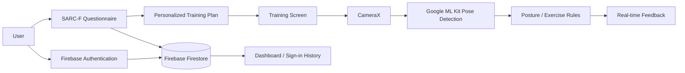

# ElderFit：長者個人化健身 App

ElderFit 是一個以 **Android / Kotlin** 開發的長者居家運動輔助 App，結合 **SARC-F 問卷、個人化訓練計畫、CameraX 與 Google ML Kit Pose Detection**，嘗試降低長者使用數位健康工具的門檻，並在訓練過程中提供即時姿態回饋。

## Project Motivation

ElderFit 的設計出發點是長者居家運動常見的幾個問題：

- 健康量表與數位工具對部分長者而言操作門檻較高
- 固定式運動菜單缺乏個人化
- 居家訓練缺少即時動作指導
- 長期使用時缺乏持續性的回饋與激勵

因此，本專案將 **SARC-F 問卷評估、個人化訓練與即時姿態偵測** 整合在同一個 Android App 中。

## Core Features

### 1. SARC-F Questionnaire

以導引式問卷呈現 SARC-F 評估流程，並將結果儲存於 Firebase。

問卷結果會進一步影響使用者的訓練內容，而不只是單純顯示分數。

### 2. Personalized Training Plan

系統根據 SARC-F 結果產生訓練項目。

目前版本包含：

- 舉水瓶（Bottle Lift）
- 上伸展手臂（Overhead Extension）
- 左腳負重腿部伸展
- 右腳負重腿部伸展
- 從椅子起身（Chair Stand）

目前實作會依 SARC-F 分數調整部分訓練內容，例如在較高風險條件下安排坐姿腿部伸展，而其他情況則安排椅子起身訓練。

### 3. Real-time Pose Detection

訓練畫面使用 **CameraX** 擷取前鏡頭影像，並以 **Google ML Kit Accurate Pose Detection** 進行即時人體姿態分析。

系統會：

- 偵測人體姿態 landmarks
- 在相機畫面上繪製 skeleton overlay
- 計算手肘、手腕、肩膀、膝蓋、腳踝等位置或角度
- 根據不同運動的規則判斷姿勢是否符合條件
- 即時顯示動作提示，例如「請舉起右手」、「請將左腳抬高伸直」等

### 4. Dashboard & Habit Tracking

主畫面包含：

- 問卷完成狀態
- 今日訓練入口
- 連續簽到天數
- 簽到月曆

用簡單的遊戲化與視覺回饋協助建立持續運動習慣。

## System Architecture

## Presentation

Project presentation / poster material:

[Google Slides](https://docs.google.com/presentation/d/1Xnk_1rNjfnGjKWUA-4VnmYe--3E-QWcHhHb0YzV-Ibk/edit?usp=sharing)

## Notes

ElderFit 為課程與成果競賽用途之原型系統，目標是探索長者友善介面、問卷個人化與即時姿態辨識的整合方式。

本專案 **不是醫療器材，也不應作為醫療診斷或治療建議的替代品**。
